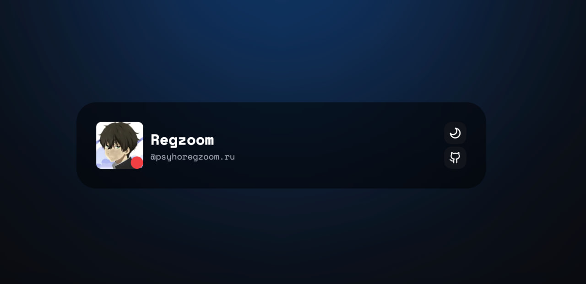

# Regzoom.ru - офицальный сайт разработчика

Чтобы сделать такой сайт для себя, необходимо:
# 1. Установить зависимости при помощи команды в консоле:
```
npm install
```
# 2. Поставить в `config.js` свои настройки (предварительно зайдя на сервер в [дискорде](https://discord.gg/lanyard))

# 3. Выполнить команду ниже:
```
npm run start
```
